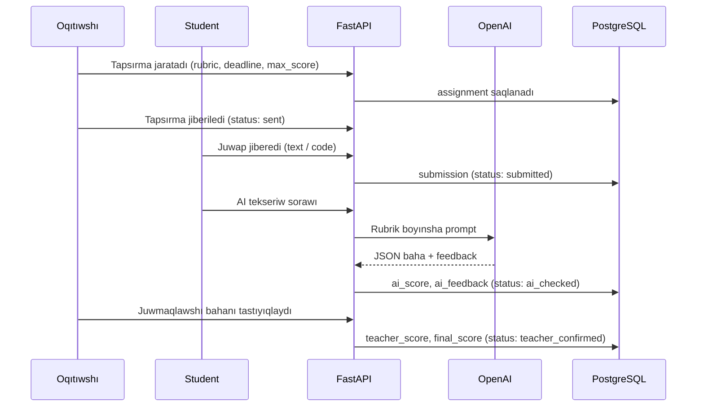
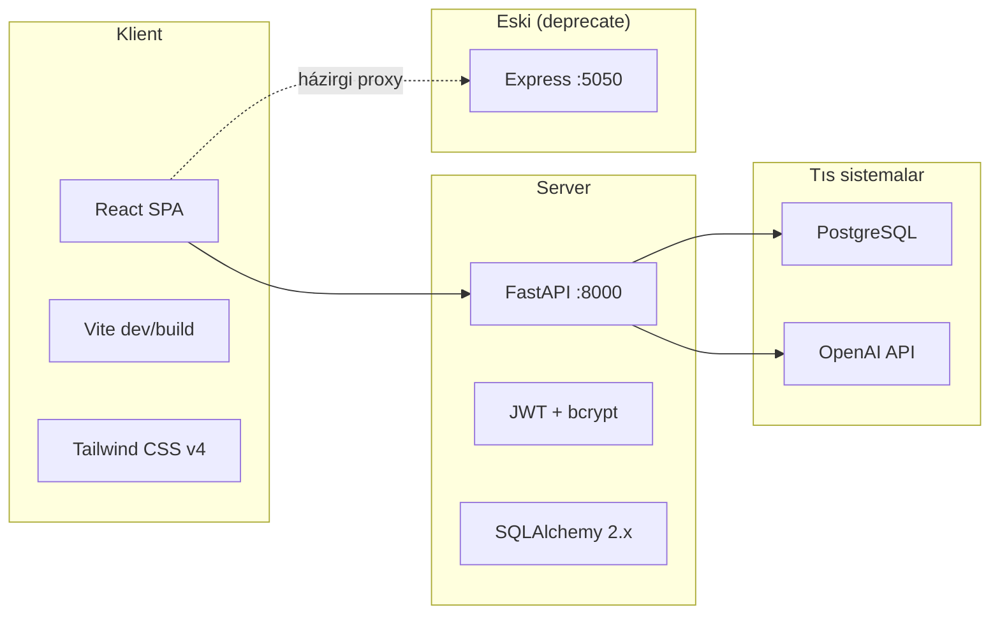
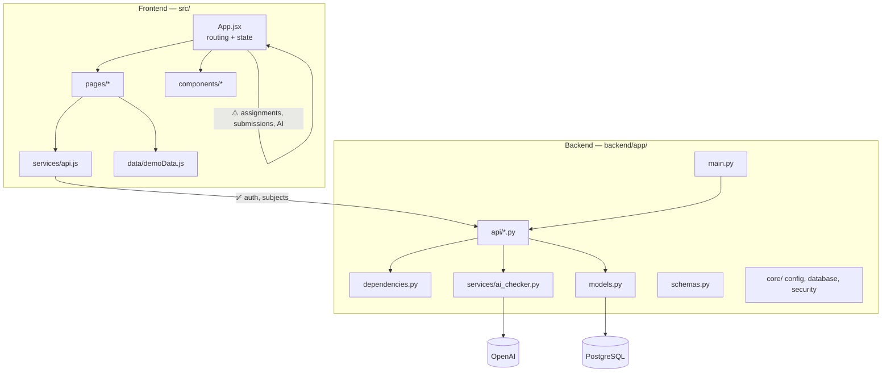
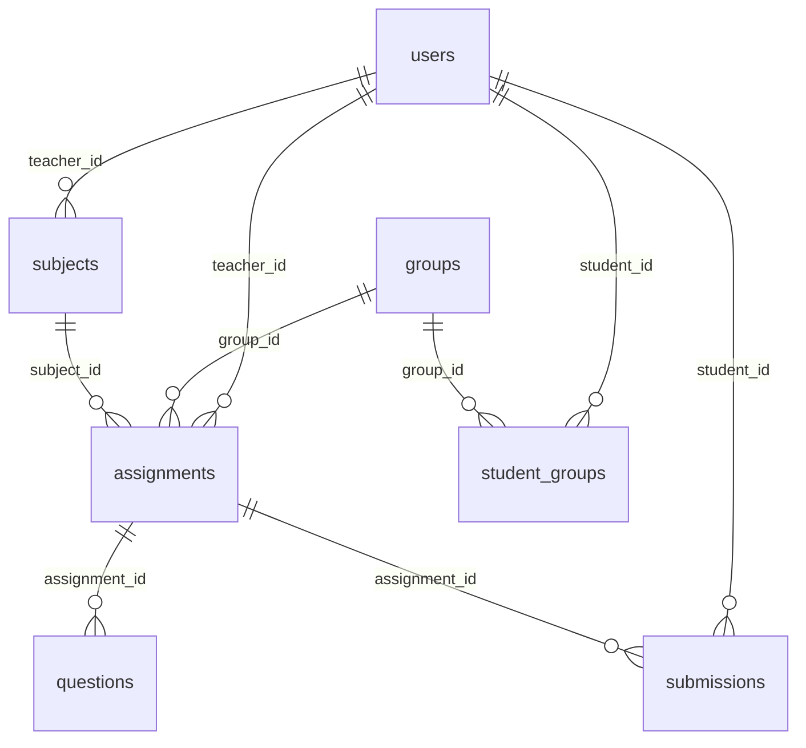
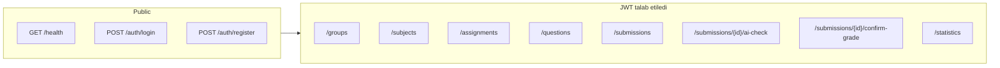
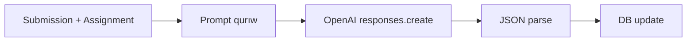
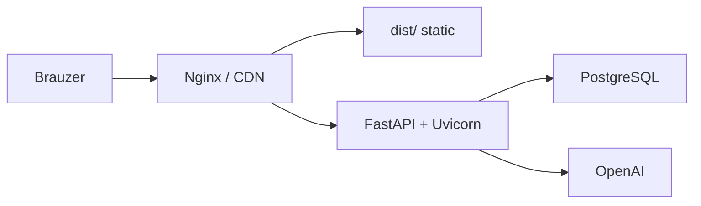

# MIKOSH — Dastur Arxitektura Blueprint

> **«INJENERLIK PEDAGOGIKA» KАFEDRАSI** professor-oqıtıwshıları ushın qaraqalpaq tilindegi masafalıq tálim platforması.

---

## 1. Maqsad va biznes jarayonı

### 1.1 Platforma maqsadı

MIKOSH — injenerlik pedagogika kafedrası ushın tapsırma/test basqarıw, student juwapları qabıllaw, AI arqalı avtomat tekseriw hám oqıtıwshı tastıyıqlawı sisteması.

### 1.2 Asosiy biznes jarayonı



### 1.3 Paydalanıwshı rolları

| Rol | Kod | Huqıqları |
|-----|-----|-----------|
| Administrator | `admin` | Barlıq gruppalar, paydalanıwshılar, statistika |
| Oqıtıwshı | `teacher` | Tapsırma jaratıw, MCQ sorawlar, bahanı tastıyıqlaw |
| Student | `student` | Óz gruppası tapsırmalarına juwap jiberiw, AI nátiyjesi |

---

## 2. Texnologiya stack



| Qatlam | Texnologiya | Fayl / joy |
|-------|-------------|------------|
| UI | React, Lucide, Recharts | `src/` |
| Build | Vite, PostCSS | `vite.config.js` |
| API | FastAPI, Uvicorn | `backend/app/` |
| ORM | SQLAlchemy | `backend/app/models.py` |
| Validatsiya | Pydantic | `backend/app/schemas.py` |
| Auth | python-jose, passlib | `backend/app/core/security.py` |
| AI | OpenAI SDK (`gpt-4.1-mini`) | `backend/app/services/ai_checker.py` |
| DB | PostgreSQL (`psycopg`) | `backend/.env` |

---

## 3. Sistema arxitekturası

### 3.1 Yuqarı dárejeli diagramma



### 3.2 Házirgi holat (gibrid prototip)

| Funksiya | Backend API | Frontend ulanısı |
|----------|-------------|------------------|
| Login / Register | ✅ | ✅ API |
| Fanlar (subjects) | ✅ | ✅ API |
| Tapsırmalar | ✅ | ❌ `App.jsx` local state |
| Juwaplar (submissions) | ✅ | ❌ local state |
| AI tekseriw | ✅ | ❌ mock (`AICheck.jsx`) |
| Bahanı tastıyıqlaw | ✅ | ❌ local state |
| Gruplar | ✅ | ❌ demo data |
| MCQ sorawlar | ✅ | ❌ |
| Statistika | ✅ | ❌ demo charts |

**Muhim:** Frontend házir «UI prototip + qısmen API» rejiminde. Production ushın barlıq sahifeler FastAPI-ga ulanıwı kerek.

### 3.3 Konfiguratsiya qarama-qarshılıǵı

| Manba | API manzili |
|-------|-------------|
| `VITE_API_URL` / `.env.example` | `http://127.0.0.1:8000/api` (FastAPI) |
| `vite.config.js` proxy `/api` | `http://127.0.0.1:5050` (Express) |

**Qarar:** Production-da tek FastAPI (:8000) qalıwı kerek; Express (`server/index.js`) deprecate etilisi.

---

## 4. Maǵlıwmat bazası sxeması



### 4.1 Kesteler

| Keste | Asosiy maydanlar | Izah |
|-------|------------------|------|
| `users` | email, password_hash, role, status | admin / teacher / student |
| `groups` | name, description | Student toplamları (mas. KT-31) |
| `subjects` | name, teacher_id | Fan / kurs |
| `student_groups` | student_id, group_id | M:N baylanıs |
| `assignments` | title, type, rubric, max_score, deadline, status | test / written / coding |
| `questions` | option_a..d, correct_answer, score | MCQ (test túri) |
| `submissions` | answer_text, code_answer, ai_score, teacher_score, final_score, ai_feedback, status | Bahalaw jarayonı |

### 4.2 Enumlar

```
UserRole:          admin | teacher | student
AssignmentType:    test | written | coding
AssignmentStatus:  draft | sent | closed
SubmissionStatus:  submitted | ai_checked | teacher_confirmed
```

### 4.3 Submission lifecycle

```
submitted → ai_checked → teacher_confirmed
              ↑ AI          ↑ Oqıtıwshı tastıyıqlawı
```

### 4.4 Migratsiya

Alembic `requirements.txt`-da bar, biraq migratsiya faylları joq. Házir `Base.metadata.create_all()` startup-da kesteler jaratadı. Production ushın Alembic qosıw kerek.

---

## 5. API blueprint

**Base URL:** `http://127.0.0.1:8000/api`  
**Auth:** `Authorization: Bearer <JWT>` (login/registerdan tıs)

### 5.1 Endpointlar xaritasi



### 5.2 Endpoint jadvali

| Method | Path | Rol | Vazifası |
|--------|------|-----|----------|
| GET | `/health` | Public | Server + OpenAI key barlıǵı |
| POST | `/auth/login` | Public | JWT qaytaradı |
| POST | `/auth/register` | Public | Jańa paydalanıwshı |
| GET/POST | `/groups` | admin, teacher | Gruppa basqarıw |
| GET/POST | `/subjects` | auth | Fanlar |
| GET/POST | `/assignments` | auth / teacher | Tapsırmalar |
| GET | `/assignments/{id}` | auth | Bitta tapsırma |
| POST | `/questions` | teacher | MCQ qosıw |
| GET/POST | `/submissions` | auth | Juwaplar |
| POST | `/submissions/{id}/ai-check` | auth | AI bahalaw |
| POST | `/submissions/{id}/confirm-grade` | teacher | Juwmaqlawshı bahası |
| GET | `/statistics` | auth | Sanlıq statistika |

### 5.3 Rol filtri (backend)

- **Student:** tek óz submissions + óz gruppası assignments
- **Teacher:** tek óz assignments/submissions
- **Admin:** barlıq maǵlıwmat

---

## 6. Frontend modul blueprint

### 6.1 Navigatsiya (React Router joq)

`App.jsx` ichinde `active` state arqalı sahifa almastırıw:

| Sahifa | Fayl | Rol | API ulanısı |
|--------|------|-----|-------------|
| Dashboard | `pages/Dashboard.jsx` | barlıq | demo |
| Fanlar | `pages/Courses.jsx` | barlıq | ✅ subjects |
| Tapsırmalar | `pages/Assignments.jsx` | teacher, student | ❌ local |
| AI Tekseriw | `pages/AICheck.jsx` | teacher, student | ❌ mock |
| Statistika | `pages/Statistics.jsx` | teacher, admin | demo |
| Studentler | `pages/Students.jsx` | teacher | demo |
| Paydalanıwshılar | `pages/Users.jsx` | admin | demo |
| Bahalaw | `pages/Assessment.jsx` | teacher | demo |
| Sazlamalar | `pages/Settings.jsx` | barlıq | UI only |

### 6.2 UI konventsiyaları

- **Til:** Qaraqalpaq (`index.html lang="kaa"`)
- **Dizayn:** Glassmorphism (`.glass`, `.premium-button`), emerald palitra
- **Dark mode:** `document.documentElement.classList`
- **Sidebar:** `components/Sidebar.jsx` — rol boyınsha menyu filtri

### 6.3 API klient

`src/services/api.js`:
- `localStorage.access_token` saqlaydı
- `VITE_API_URL` orqalı base URL
- Auth, subjects metodları tayar

---

## 7. AI tekseriw servisi

**Fayl:** `backend/app/services/ai_checker.py`



### 7.1 AI javap formatı

```json
{
  "score": 0,
  "max_score": 100,
  "summary": "qısqa xulasa",
  "mistakes": ["qátelik 1"],
  "recommendations": ["usınıs 1"],
  "teacher_note": "oqıtıwshı ushın esletpe"
}
```

### 7.2 Qatıy qoideler

- Tek berilgen rubrik hám juwap boyınsha bahalaw
- Qosımsha faktlar oylamaydı
- Javap tili: Qaraqalpaq
- API key tek server `.env`-da

---

## 8. Xavfsizlik modeli

| Qatlam | Amal |
|--------|------|
| Parol | bcrypt hash |
| Sessiya | JWT (python-jose) |
| Klient | `localStorage` — kelajekte refresh token |
| API | `require_roles()` middleware |
| Maǵlıwmat izolyatsiyası | Rol boyınsha query filter |
| OpenAI key | Server-only, `/health` tek barlıǵın kórsetedi |

---

## 9. Ishga túsiriw (deployment blueprint)

### 9.1 Development

```bash
# 1. PostgreSQL
createdb ai_tapsirma_platformasi

# 2. Backend
cd backend && pip install -r requirements.txt
cp .env.example .env   # DATABASE_URL, JWT, OPENAI
python seed.py
uvicorn app.main:app --reload   # :8000

# 3. Frontend
npm install
cp .env.example .env   # VITE_API_URL=http://127.0.0.1:8000/api
npm run dev            # :5173
```

### 9.2 Production maqsatlı arxitektura



| Komponent | Tavsiya |
|-----------|---------|
| Frontend | `npm run build` → Nginx static |
| Backend | Uvicorn/Gunicorn, HTTPS |
| DB | PostgreSQL managed yaki dedicated |
| Secrets | `.env` / vault, Git-qa commit etilmesin |
| Migrations | Alembic CI/CD-da |

---

## 10. Integratsiya rejesi (fazalar)

### Faza 1 — API ulanısı (prioritet)

- [ ] `Assignments.jsx` → `GET/POST /assignments`
- [ ] Student juwap → `POST /submissions`
- [ ] `AICheck.jsx` → `POST /submissions/{id}/ai-check`
- [ ] Oqıtıwshı tastıyıqlaw → `POST /confirm-grade`
- [ ] `vite.config.js` proxy → FastAPI yaki proxy olib tashlaw

### Faza 2 — Tolıq funksional

- [ ] Gruplar UI → `/groups`
- [ ] MCQ sorawlar forması → `/questions`
- [ ] Test túri avtomat bahalaw (MCQ)
- [ ] `Statistics.jsx` → `/statistics`
- [ ] Express server olib tashlaw

### Faza 3 — Production tayarlaw

- [ ] Alembic migratsiyalar
- [ ] Fayl júklew (FastAPI `UploadFile`) — házir UI faqat browser File
- [ ] AI tekseriw queue (uzın islemeler ushın)
- [ ] Refresh token / sessiya qattılastırıw
- [ ] Testlar (pytest + vitest)

---

## 11. Papka strukturası (tolıq)

```
MIKOSH/
├── backend/
│   ├── app/
│   │   ├── api/           # REST routerlar
│   │   ├── core/          # config, database, security
│   │   ├── services/      # ai_checker.py
│   │   ├── main.py        # FastAPI entry
│   │   ├── models.py      # ORM
│   │   ├── schemas.py     # DTO
│   │   └── dependencies.py
│   ├── seed.py
│   └── requirements.txt
├── src/
│   ├── components/        # UI komponentlar
│   ├── pages/             # Sahifalar
│   ├── services/api.js    # HTTP klient
│   ├── data/demoData.js   # Demo maǵlıwmat
│   ├── App.jsx            # SPA shell
│   └── main.jsx
├── server/                # ⚠️ Legacy Express — deprecate
├── docs/
│   └── BLUEPRINT.md       # Bul dokument
├── README.md
├── package.json
└── vite.config.js
```

---

## 12. Xulosa

MIKOSH — **backend tayar, frontend prototip** fazasında. Asosiy biznes mantiqı (tapsırma → juwap → AI → tastıyıqlaw) FastAPI + PostgreSQL + OpenAI da tolıq implementatsiya qılınǵan. Keyingi qadam — frontendni API-ga ulaw hám gibrid holatdan tolıq production stackke ótiw.

**OpenAPI dokumentatsiya:** backend iske túsgende `http://127.0.0.1:8000/docs`
